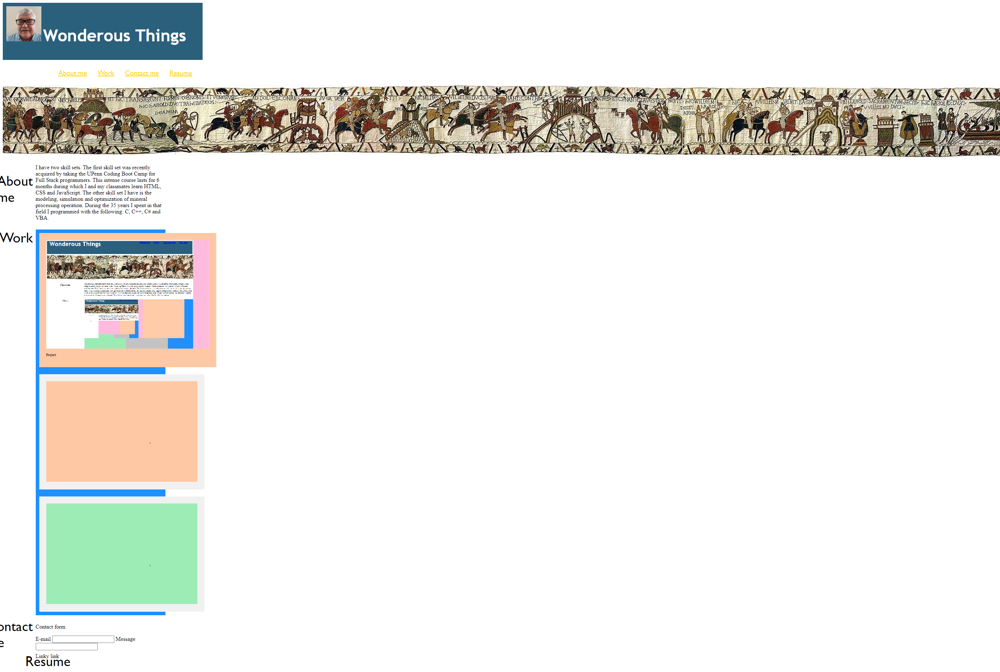

# <Portfolio>
## Description
This web page describes me, William T Pate. It tells a little about me in the About Me section. Links to the public projects on my GitHub account are provided. A way to contact me are provided but doesn't actually work. This web page has only HTML and CSS elements and is in a simple unsophisticated state. Overtime it will be improved.
 
This web page is a work in progress and will be continuously upgraded
 
Version 1.0 14-Mar-2021 Initial version

## Installation
Here are the links to the GitHub project for this web page and to the web page itself
 
[https://github.com/minprocess/Portfolio](https://github.com/minprocess/Portfolio/)
 
[https://minprocess.github.io/Portfolio/](https://minprocess.github.io/Portfolio/)

## Usage

The following table is how this page is supposed to perform.
 
| When | Then | Status | My Grade |
| :------------- | :---------- | :-----------: | :-----------: |
| I load my portfolio | I am presented with my name, a recent photo, and links to sections about me, my work, and how to contact me | Done | C |
| I click one of the links in the navigation | the UI scrolls to the corresponding section | Done | B |
| I click on the link to the section about their work | the UI scrolls to a section with titled images of the developer's applications | Done | C |
| I am presented with the developer's first application | that application's image should be larger in size than the others | Done | C |
| I click on the images of the applications | I am taken to that deployed application | Done | B |
| I resize the page or view the site on various screens and devices | I am presented with a responsive layout that adapts to my viewport | F |

## Screenshot

## Credits
I had several Slack chats with Amy Smerlick during the past week about how some things could be accomplished.
 
Also very helpful were Anthony Bagiagil, Boot Camp instructor, and Tom Woods Boot Camp TA.
 
Finally serveral BCS Assistants answered my questions.
 

## License
MIT License

Copyright (c) 2021 William T. Pate

Permission is hereby granted, free of charge, to any person obtaining a copy
of this software and associated documentation files (the "Software"), to deal
in the Software without restriction, including without limitation the rights
to use, copy, modify, merge, publish, distribute, sublicense, and/or sell
copies of the Software, and to permit persons to whom the Software is
furnished to do so, subject to the following conditions:

The above copyright notice and this permission notice shall be included in all
copies or substantial portions of the Software.

THE SOFTWARE IS PROVIDED "AS IS", WITHOUT WARRANTY OF ANY KIND, EXPRESS OR
IMPLIED, INCLUDING BUT NOT LIMITED TO THE WARRANTIES OF MERCHANTABILITY,
FITNESS FOR A PARTICULAR PURPOSE AND NONINFRINGEMENT. IN NO EVENT SHALL THE
AUTHORS OR COPYRIGHT HOLDERS BE LIABLE FOR ANY CLAIM, DAMAGES OR OTHER
LIABILITY, WHETHER IN AN ACTION OF CONTRACT, TORT OR OTHERWISE, ARISING FROM,
OUT OF OR IN CONNECTION WITH THE SOFTWARE OR THE USE OR OTHER DEALINGS IN THE
SOFTWARE.
